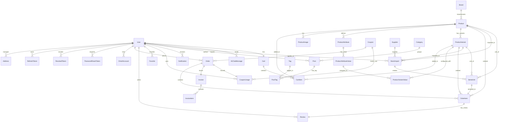

# NexTech — Database Schema & Entity-Relationship Diagram (ERD)

This document provides a comprehensive view of the database layer for the NexTech platform. The system uses a PostgreSQL database, managed entirely via **Prisma ORM**. The schema is comprised of **37 models** which capture the platform's rich capabilities, from product variant matrix configurations to dual payment webhooks, individual IMEI/serial inventory tracking, electronic VAT invoice snapshots, and separate admin authentication.

---

## 1. Visual Entity-Relationship Diagram (ERD)

The following interactive diagram shows how all 37 models in the NexTech system are connected.

---

## 2. Table References Grouped by Domain

The database is structured into 5 logical domains. Every table corresponds to a Prisma model.

### 2.1 Core Users & Security Domain

Manages customers, administrators, multi-address structures, OAuth account links, and JWT token rotation/revocation security lists.

#### `users` (User Model)
The primary account model storing credentials, profile details, and metadata.
*   `id` (String, Primary Key): Generated using the `cuid()` standard.
*   `name`, `email` (String): Required fields. `email` is enforced as unique.
*   `password` (String, Optional): Nullable to accommodate Google/Facebook social logins.
*   `role` (Enum: `USER`, `ADMIN`): Default role is `USER`.
*   `isActive` (Boolean): Default `true`. Can be flipped to `false` to suspend accounts.
*   `isEmailVerified` (Boolean): Default `false`. Required for checkout or updating shipping profiles.
*   `emailVerifyToken`, `emailVerifyTokenExpiry`: Used during the verification workflow.
*   `avatar`, `phone` (String, Optional): Custom profile details.
*   `createdAt`, `updatedAt` (DateTime).

#### `addresses` (Address Model)
Handles multiple delivery profiles per user.
*   `id` (String, Primary Key): `cuid()`.
*   `userId` (String): Relates to `users.id` with a cascade deletion trigger.
*   `fullName`, `phone`, `address`, `city`, `ward` (String): Granular delivery details.
*   `isDefault` (Boolean): Enforces a single default delivery profile per user via service-layer validations.

#### `refresh_tokens` (RefreshToken Model)
Tracks active sessions for token rotation.
*   `id` (String, Primary Key): `cuid()`.
*   `token` (String): Enforced unique index.
*   `userId` (String): Linked to `users.id` (on-delete cascade).
*   `expiresAt` (DateTime): Absolute expiration bound.
*   `ipAddress`, `userAgent` (String, Optional): Captured during session generation for security audits.

#### `revoked_tokens` (RevokedToken Model)
Blacklist of invalidated JWT refresh tokens (e.g., sessions invalidated on logout).
*   `token` (String, Unique Index).
*   `userId` (String): Reference to user.
*   `revokedAt` (DateTime): Default `now()`.
*   `reason` (String, Optional): Identifies if the token was manually revoked, logged out, or rotated.

#### `password_reset_tokens` (PasswordResetToken Model)
One-time tokens generated during forgotten-password recovery flows.
*   `token` (String, Unique Index).
*   `userId` (String): Associated account.
*   `expiresAt` (DateTime): Bound to short validity periods.
*   `used` (Boolean): Flips to `true` upon verification to prevent reuse.

#### `oauth_accounts` (OAuthAccount Model)
Stores linked third-party authentication identities (Passport Google/Facebook strategy).
*   `id` (String, Primary Key).
*   `userId` (String): References `users.id`.
*   `provider` (String): Identifies the source (e.g., `google`, `facebook`).
*   `providerAccountId` (String): Unique identifier provided by the identity issuer.
*   *Compound Constraints*: Unique index on `[provider, providerAccountId]` ensures no account collision.

---

### 2.2 Product Catalog Domain

Configures products, brands, attributes, images, and the multi-dimensional variant configuration matrix (e.g., iPhone 15 Pro Max configured in "Natural Titanium" × "256GB").

#### `products` (Product Model)
Main product catalog entity.
*   `id` (String, PK).
*   `name` (String), `slug` (String, Unique Index).
*   `description` (String): Supports detailed HTML/Text information.
*   `price` (Decimal, 15,2): Standard retail price.
*   `stock` (Int): Aggregated integer stock (bypassed if serial-tracking is active).
*   `category` (String): Category classifier (e.g., `phone`, `laptop`, `accessories`).
*   `rating` (Float), `numReviews` (Int): Computed cache of buyer ratings.
*   `brandId` (String, Optional): Links to the manufacturer.
*   `isBestseller`, `isNewArrival` (Boolean): Frontpage curation filters.
*   `salePrice` (Decimal, Optional), `saleExpiresAt` (DateTime, Optional), `saleStock` (Int, Optional): Used by the Homepage **Flash Sale countdown** component.
*   `saleSoldCount` (Int): Tracks real-time flash-sale items purchased.
*   `hasVariants` (Boolean): Defines if the product redirects to variant matrix configurations.
*   `lowStockThreshold` (Int): Triggers notification when stock counts drop.
*   `specsJson` (Json, Optional): Houses specifications table crawled from external pages.

#### `product_images` (ProductImage Model)
Stores Cloudinary-hosted product gallery items.
*   `id`, `url` (String), `publicId` (String): Assets hosted on Cloudinary.
*   `productId` (String): Cascades on-delete from parent product.

#### `brands` (Brand Model)
Manufacturers and brands.
*   `id`, `name`, `slug` (String, Unique).
*   `logo`, `description` (String, Optional).
*   `carouselOrder` (Int, Optional): Specific ordering order on the homepage banner carousel.
*   `websiteUrl` (String, Optional): If present, carousel clicks redirect to external brand page.

#### `product_attributes` (ProductAttribute Model)
Key attribute groups for variant configuration (e.g., `Color`, `Storage`).
*   `id` (String), `name` (String), `position` (Int).
*   `productId` (String): Linked to parent product.

#### `product_attribute_values` (ProductAttributeValue Model)
Concrete attribute options (e.g., `Space Gray`, `Gold`, `128GB`, `512GB`).
*   `id` (String), `value` (String), `position` (Int).
*   `attributeId` (String): References `product_attributes.id`.

#### `product_variants` (ProductVariant Model)
Specific variant SKUs containing individual overrides for pricing, stock, and images.
*   `id` (String, PK).
*   `sku` (String, Unique Index).
*   `price` (Decimal, 15,2), `stock` (Int), `imageUrl` (String, Optional).
*   `salePrice`, `saleExpiresAt`, `saleStock`, `saleSoldCount` (Flash sale matrix).
*   `deletedAt` (DateTime, Optional): Soft delete flag to retain historical order item records without showing active options.

#### `product_variant_values` (ProductVariantValue Model)
Many-to-many bridge resolving exactly which attributes describe a specific variant.
*   `variantId` (String), `attributeValueId` (String).
*   *Compound Key*: `[variantId, attributeValueId]`.

---

### 2.3 Cart, Orders & Invoice Domain

Covers user carts, discount coupons, orders, individual order lines, product reviews, and financial tax invoices.

#### `carts` (Cart Model)
Shopping cart root.
*   `id` (String, PK).
*   `userId` (String, Unique): One-to-one mapped to user.

#### `cart_items` (CartItem Model)
Items actively held in user carts.
*   `id` (String), `quantity` (Int).
*   `cartId` (String), `productId` (String).
*   `variantId` (String, Optional): Associated variant selection.
*   *Compound Index*: Unique `[cartId, productId, variantId]` prevents duplicate rows, consolidating selections into quantity increments.

#### `orders` (Order Model)
Core transactional record tracking order statuses and tax configurations.
*   `id` (String, PK).
*   `userId` (String): References buyer.
*   `status` (Enum: `PENDING`, `CONFIRMED`, `PACKING`, `SHIPPING`, `COMPLETED`, `CANCELLED`, `RETURNED`).
*   `paymentStatus` (Enum: `UNPAID`, `PAID`, `REFUNDED`).
*   `paymentMethod` (String): (e.g., `STRIPE`, `SEPAY`, `COD`).
*   `totalAmount` (Decimal, 15,2): Grand total after deductions and VAT.
*   `discountAmount` (Decimal, 15,2): Deducted amount from active coupons.
*   `shippingAddress` (Json): Hard copy snapshot of address at payment time (prevents historical modifications from corrupting shipping logs).
*   `stripeClientSecret`, `stripePaymentIntentId` (String, Unique, Optional).
*   `couponId` (Int, Optional): Associated discount card.
*   `trackingCode`, `trackingUrl`, `carrierName` (String, Optional): Fulfillment tracking details.
*   `adminNote` (String, Optional): Internal order memos.
*   *VAT Invoice fields*: `vatInvoiceRequested` (Boolean), `vatBuyerType` (Enum: `INDIVIDUAL`, `COMPANY`), buyer name, company, tax code, email, billing address.

#### `order_item` (OrderItem Model)
Individual order line items.
*   `id` (String, PK), `quantity` (Int).
*   `price`, `originalPrice` (Decimal, 15,2).
*   `orderId`, `productId`, `variantId` (Optional).
*   `serialUnitId` (String, Unique, Optional): References the specific mapped physical serial number.

#### `reviews` (Review Model)
Verified customer reviews.
*   `id` (String, PK), `rating` (Int: 1-5), `comment` (String, Optional).
*   `userId`, `productId`.
*   `orderItemId` (String, Unique): Ensures each purchased order item can only be reviewed once.

#### `coupons` (Coupon Model)
Store promotion codes.
*   `id` (Int, PK), `code` (String, Unique Index).
*   `type` (Enum: `PERCENTAGE`, `FIXED_AMOUNT`).
*   `value` (Float): Discount magnitude.
*   `minOrderAmount` (Float): Minimum basket size needed.
*   `maxDiscountAmount` (Float, Optional): Cap limit for percentage deductions.
*   `maxUsage` (Int), `usedCount` (Int): Threshold constraints.
*   `expiresAt` (DateTime), `isActive` (Boolean).

#### `coupon_usages` (CouponUsage Model)
One-to-one record preventing abuse of single-use coupons.
*   `couponId` (Int), `userId` (String), `orderId` (String, Unique).
*   *Compound Key*: Unique on `[couponId, userId]` prevents double usage.

#### `invoices` (Invoice Model)
VAT invoice records generated upon admin verification.
*   `id` (String, PK), `invoiceNumber` (String, Unique Index).
*   `orderId` (String, Unique).
*   `status` (Enum: `DRAFT`, `ISSUED`, `CANCELLED`).
*   *Financial fields*: `subtotal` (Decimal), `discountAmount` (Decimal), `vatRate` (Decimal: default `0.10`), `vatAmount` (Decimal), `totalAmount` (Decimal).
*   *Snapshots*: Stores static billing details (`buyerName`, `buyerAddress`, `buyerTaxCode`, `sellerName`, `sellerTaxCode`, etc.).

#### `invoice_items` (InvoiceItem Model)
Static copies of ordered lines baked directly into the invoice.
*   `id` (String, PK), `quantity` (Int).
*   `productName` (String), `sku` (String, Optional).
*   `unitPrice`, `totalPrice` (Decimal).

---

### 2.4 Inventory Tracking Domain

Detailed inventory mapping. Supports basic integer stock decrements or strict serialization/IMEI tracking for premium consumer electronics (e.g., phones, tablets).

#### `suppliers` (Supplier Model)
Distributors supplying stock imports.
*   `id` (String, PK).
*   `name` (String), `phone`, `email`, `address`, `notes` (String, Optional).
*   `isActive` (Boolean): Default `true`.

#### `stock_imports` (StockImport Model)
A formal intake batch of stock.
*   `id` (String, PK), `totalUnits` (Int), `unitCost` (Decimal, 15,2), `importDate` (DateTime).
*   `supplierId` (String), `productId` (String), `variantId` (String, Optional).
*   `importedBy` (String): References user ID (Admin) performing the action.

#### `serial_units` (SerialUnit Model)
Individual serialized units (tracked by IMEI or unique serial).
*   `id` (String, PK).
*   `serial` (String, Unique Index): Unique identification string.
*   `productId` (String), `variantId` (String, Optional).
*   `stockImportId` (String): Traceability path back to the supplier.
*   `status` (Enum: `IN_STOCK`, `RESERVED`, `SOLD`, `RETURNED`).
*   `reservedAt`, `soldAt`, `returnedAt` (DateTime, Optional).

---

### 2.5 Utilities & System Domain

System helpers, scheduled tasks, real-time message tables, support threads, and configuration states.

#### `shop_settings` (ShopSettings Model)
A **Singleton** table capturing store metadata and cron parameters.
*   `id` (String, PK): Locked to value `"singleton"`.
*   `shopName`, `shopAddress`, `taxCode`, `bankAccount`, `phone`, `email` (String, Optional).
*   `vatRate` (Decimal): Default `0.10`.
*   `lowStockAlertEnabled` (Boolean): Controls email alerts to administrators.
*   `lowOrderAlertEnabled`, `lowOrderAlertThreshold`, `lowOrderAlertInterval` (Hourly, Daily, Monthly): Controls the sales drop detection job.

#### `notifications` (Notification Model)
User-facing database notifications, synchronized via Soketi WebSockets.
*   `id` (String, PK).
*   `userId` (String).
*   `type` (String): (e.g., `order_status_changed`, `wishlist_price_drop`, `low_stock`).
*   `title`, `message` (String).
*   `data` (Json, Optional): Carries route payload strings (e.g., `{ "orderId": "..." }`).
*   `isRead` (Boolean): Default `false`.

#### `categories` (Category Model)
Blog category tags.
*   `id` (Int, PK).
*   `name`, `slug` (String, Unique).

#### `tags` (Tag Model)
Blog tags.
*   `id` (Int, PK).
*   `name`, `slug` (String, Unique).

#### `posts` (Post Model)
Store blog articles.
*   `id` (Int, PK), `title`, `slug` (String, Unique), `content` (HTML text), `excerpt` (String, Optional).
*   `coverImage` (String, Cloudinary), `status` (Enum: `DRAFT`, `PUBLISHED`, `SCHEDULED`, `ARCHIVED`).
*   `readTime` (Int, Optional): Calculated reading duration.
*   `publishedAt`, `scheduledAt` (DateTime, Optional).
*   `authorId` (String): References writer.
*   `categoryId` (Int, Optional).

#### `post_tags` (PostTag Model)
Many-to-many join resolving article tags.
*   `postId` (Int), `tagId` (Int).
*   *Compound Key*: `[postId, tagId]`.

#### `failed_emails` (FailedEmail Model)
Transactional email fallback queue.
*   `id` (Int, PK).
*   `type`, `to` (String), `data` (Json): Serialized EJS data parameters.
*   `attempts` (Int): Default `0`. Capped and retried via cron.
*   `lastError` (String, Optional): Log of stack traces for debugging.
*   `status` (String): Default `"FAILED"`. Flips to `"RESOLVED"` once successfully dispatched.

#### `ai_chat_messages` (AIChatMessage Model)
Saves customer chats with the platform's AI shopping assistant.
*   `id` (String, PK).
*   `userId` (String).
*   `role` (String): `user` or `model`.
*   `content` (String): Stored message.

---

## 3. Notable Architectural Schema Choices

*   **Floating-Point Safety**: Currency columns are strictly configured using Postgres `NUMERIC` via Prisma's `Decimal` type (e.g., `Decimal(15,2)`). This prevents floating-point rounding anomalies during discount arithmetic, VAT computations, and checkout procedures.
*   **Soft Deletion of Variants**: To prevent order records from breaking if an item is discontinued, variants use a nullable `deletedAt` field. This hides them from shopping catalog queries while retaining historical references for orders and invoices.
*   **Idempotency & Abuse Guarding**: Compound indices like `@@unique([cartId, productId, variantId])` on `CartItem` prevent duplicate row conflicts, updating quantities instead. Similarly, `@@unique([couponId, userId])` on `CouponUsage` guarantees customers cannot use single-use coupons more than once.
